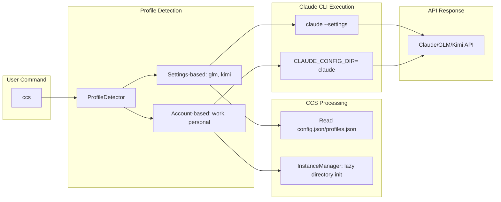

# CCS - Claude Code Switch

<div align="center">


**One command, zero downtime, right model for each task**

Switch between Claude Sonnet 4.5, GLM 4.6, and Kimi for Coding instantly. Stop hitting rate limits. Start optimizing costs.


[](LICENSE)
[]()
[](https://www.npmjs.com/package/@kaitranntt/ccs)
[](https://claudekit.cc?ref=HMNKXOHN)

**Languages**: [English](README.md) | [Tiếng Việt](README.vi.md)

</div>

---

## 🚀 Quick Start

### 🔑 Prerequisites

**Before installing CCS, make sure you're logged into Claude CLI with your subscription account:**
```bash
claude /login
```

### Primary Installation Methods

#### Option 1: npm Package (Recommended)

**macOS / Linux / Windows**
```bash
npm install -g @kaitranntt/ccs
```

Compatible with npm, yarn, pnpm, and bun package managers.

#### Option 2: Direct Install (Traditional)

**macOS / Linux**
```bash
curl -fsSL ccs.kaitran.ca/install | bash
```

**Windows PowerShell**
```powershell
irm ccs.kaitran.ca/install | iex
```

### Your First Switch

```bash
# Use Claude subscription (default)
ccs "Review this architecture design"

# Switch to GLM for cost-optimized tasks
ccs glm "Create a simple REST API"

# Switch to Kimi for alternative option
ccs kimi "Write integration tests"

# Use GLM for all subsequent commands until switched back
ccs glm
ccs "Debug this issue"
ccs "Write unit tests"
```

#### Package Manager Options

All major package managers are supported:

```bash
# npm (default)
npm install -g @kaitranntt/ccs

# yarn
yarn global add @kaitranntt/ccs

# pnpm (70% less disk space)
pnpm add -g @kaitranntt/ccs

# bun (30x faster)
bun add -g @kaitranntt/ccs
```

### Configuration (Auto-created)

**CCS automatically creates configuration during installation** (via npm postinstall script).

**~/.ccs/config.json**:
```json
{
  "profiles": {
    "glm": "~/.ccs/glm.settings.json",
    "kimi": "~/.ccs/kimi.settings.json",
    "default": "~/.claude/settings.json"
  }
}
```

### Custom Claude CLI Path

If Claude CLI is installed in a non-standard location (D drive, custom directory), set `CCS_CLAUDE_PATH`:

```bash
export CCS_CLAUDE_PATH="/path/to/claude"              # Unix
$env:CCS_CLAUDE_PATH = "D:\Tools\Claude\claude.exe"   # Windows
```

**See [Troubleshooting Guide](./docs/en/troubleshooting.md#claude-cli-in-non-standard-location) for detailed setup instructions.**

---

## The Daily Developer Pain Point

You have Claude subscription, GLM Coding Plan, and Kimi for Coding. Three scenarios happen every day:

1. **Rate Limits Hit**: Claude stops mid-project → you manually edit `~/.claude/settings.json`
2. **Cost Waste**: Simple tasks use expensive Claude → GLM or Kimi would work fine
3. **Model Choice**: Different tasks benefit from different model strengths → manual switching

Manual switching breaks your flow. **CCS fixes it instantly**.

## Why CCS Instead of Manual Switching?

<div align="center">

| Feature | Benefit | Emotional Value |
|---------|---------|-----------------|
| **Instant Switching** | One command, no file editing | Confidence, control |
| **Zero Downtime** | Never interrupt your workflow | Reliability, consistency |
| **Smart Delegation** | Right model for each task automatically | Simplicity, ease |
| **Cost Control** | Use expensive models only when needed | Efficiency, savings |
| **Cross-Platform** | Works on macOS, Linux, Windows | Flexibility, portability |
| **Reliable** | Pure bash/PowerShell, zero dependencies | Trust, peace of mind |

</div>

**The Solution**:
```bash
ccs           # Use Claude subscription (default)
ccs glm       # Switch to GLM fallback
ccs kimi      # Switch to Kimi for Coding
# Hit rate limit? Switch instantly:
ccs glm       # Continue working with GLM
# Or switch to Kimi:
ccs kimi      # Continue working with Kimi
```

One command. Zero downtime. No file editing. Right model, right task.

---

## 🏗️ Architecture Overview (v3.0 Simplified)

**v3.0 Login-Per-Profile Model**: Each profile is an isolated Claude instance where users login directly. No credential copying or vault encryption.



---

## ⚡ Features

### Instant Profile Switching
- **One Command**: `ccs glm` to switch to GLM, `ccs` to use Claude subscription - no config file editing
- **Smart Detection**: Automatically uses right model for each task
- **Persistent**: Switch stays active until changed again

### Concurrent Sessions (All Platforms)
- **Multiple Profiles Simultaneously**: Run `ccs work` and `ccs personal` in different terminals concurrently
- **Isolated Instances**: Each profile gets own config directory (`~/.ccs/instances/<profile>/`)
- **Independent Sessions**: Separate login, chat sessions, todos, logs per profile
- **Platform Parity**: Works identically on macOS, Linux, and Windows via `CLAUDE_CONFIG_DIR`
- **Backward Compatible**: Existing settings profiles (glm, kimi) work unchanged

### Zero Workflow Interruption
- **No Downtime**: Switching happens instantly between commands
- **Context Preservation**: Your workflow remains uninterrupted
- **Seamless Integration**: Works exactly like native Claude CLI


---

## 💻 Usage Examples

### Basic Profile Switching
```bash
ccs              # Use Claude subscription (default)
ccs glm          # Use GLM fallback
ccs kimi         # Use Kimi for Coding
ccs --version    # Show CCS version and install location
```

### Concurrent Sessions (Multi-Account)
```bash
# First time: Create profile and login
ccs auth create work        # Opens Claude, prompts for login
ccs auth create personal    # Opens Claude, prompts for login

# Terminal 1 - Work account
ccs work "implement feature"

# Terminal 2 - Personal account (concurrent)
ccs personal "review code"

# Both run simultaneously with isolated logins/sessions
# Works on all platforms: macOS, Linux, Windows
```

---

### 🗑️ Official Uninstall

**The recommended way to completely remove CCS:**

**macOS / Linux**:
```bash
curl -fsSL ccs.kaitran.ca/uninstall | bash
```

**Windows PowerShell**:
```powershell
irm ccs.kaitran.ca/uninstall | iex
```

> 💡 **Why use the official uninstaller?**
> - Removes all CCS files and configurations
> - Cleans up PATH modifications
> - Removes Claude CLI commands/skills
> - Handles edge cases we've tested

**Alternative methods** (if official uninstaller fails):
- **npm**: `npm uninstall -g @kaitranntt/ccs`
- **Manual**: See [troubleshooting guide](./docs/en/troubleshooting.md#manual-uninstall)

---

## 🎯 Philosophy

- **YAGNI**: No features "just in case"
- **KISS**: Simple bash, no complexity
- **DRY**: One source of truth (config)

---

## 📖 Documentation

**Complete documentation in [docs/](./docs/)**:
- [Installation Guide](./docs/en/installation.md)
- [Configuration](./docs/en/configuration.md)
- [Usage Examples](./docs/en/usage.md)
- [Troubleshooting](./docs/en/troubleshooting.md)
- [Contributing](./docs/en/contributing.md)

---

## 🤝 Contributing

We welcome contributions! Please see our [Contributing Guide](./docs/en/contributing.md) for details.

---

## 📄 License

CCS is licensed under the [MIT License](LICENSE).

---

<div align="center">

**Made with ❤️ for developers who hit rate limits too often**

[⭐ Star this repo](https://github.com/kaitranntt/ccs) | [🐛 Report issues](https://github.com/kaitranntt/ccs/issues) | [📖 Read docs](./docs/en/)

</div>