# CCS System Architecture

## Overview

CCS (Claude Code Switch) is a lightweight CLI wrapper that provides instant profile switching between Claude Sonnet 4.5 and GLM 4.6 models. The architecture has been recently simplified to achieve a 35% reduction in codebase size while maintaining all functionality.

## Core Architecture Principles

### Design Philosophy
- **YAGNI** (You Aren't Gonna Need It): No features "just in case"
- **KISS** (Keep It Simple): Minimal complexity, maximum reliability
- **DRY** (Don't Repeat Yourself): Single source of truth for each concern

### Simplification Goals
- Consolidate duplicate logic into reusable functions
- Remove unnecessary validation layers ("security theater")
- Simplify error handling and messaging
- Maintain cross-platform compatibility

## High-Level Architecture

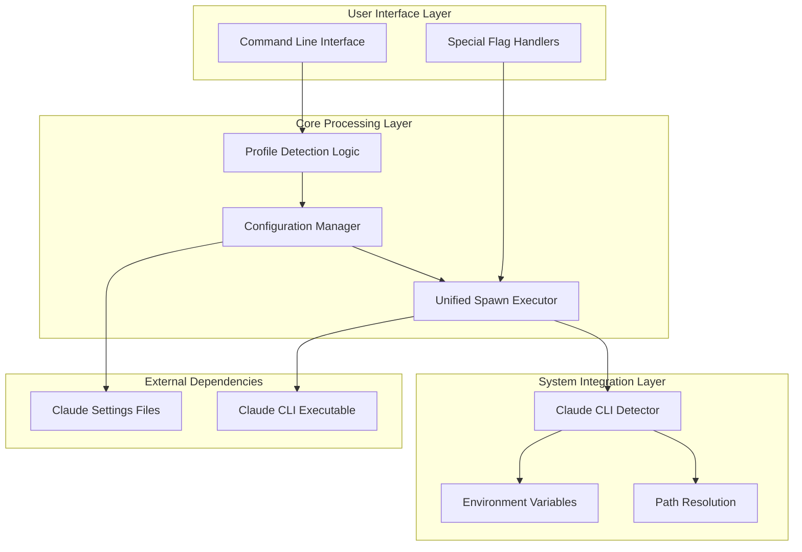

## Component Architecture

### 1. Main Entry Point (`bin/ccs.js`)

**Role**: Central orchestrator for all CCS operations

**Key Responsibilities**:
- Argument parsing and profile detection
- Special command handling (--version, --help, auth) [--install/--uninstall WIP]
- Profile type routing (settings-based vs account-based)
- Unified process execution through `execClaude()`
- Error propagation and exit code management

**Architecture with Concurrent Sessions**:
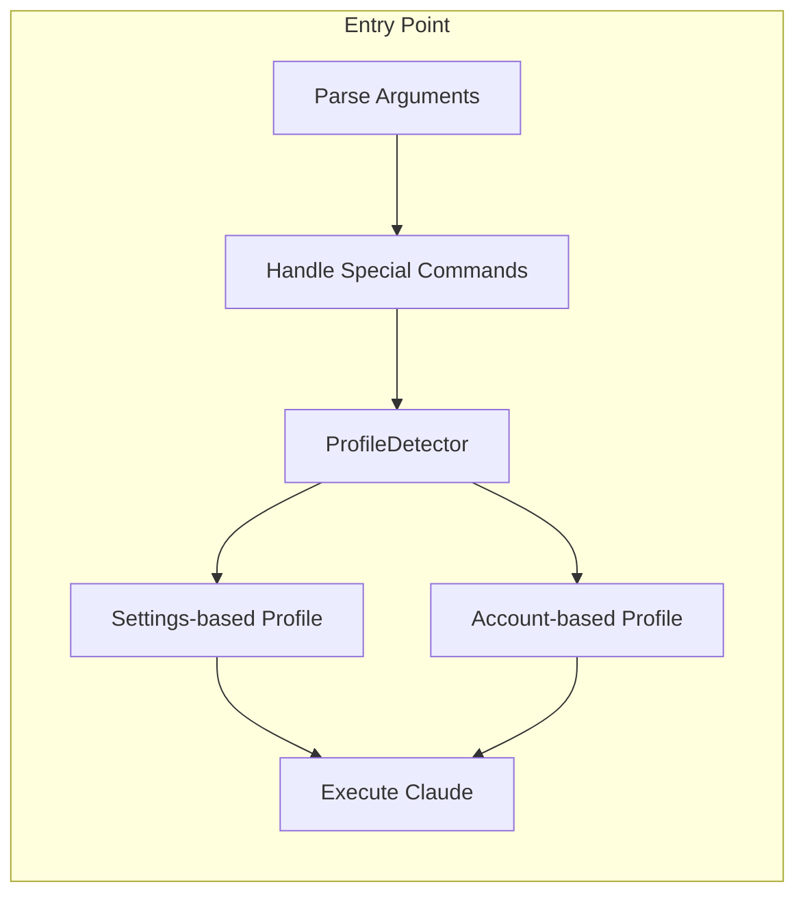

**Key Enhancement ()**: Dual-path execution supporting both `--settings` flag (backward compatible) and `CLAUDE_CONFIG_DIR` env var (concurrent sessions).

### 2. Configuration Manager (`bin/config-manager.js`)

**Role**: Handles all configuration-related operations

**Key Responsibilities**:
- Configuration file path resolution
- JSON parsing and validation
- Profile-to-settings-file mapping
- Error handling for configuration issues

**Architecture Flow**:
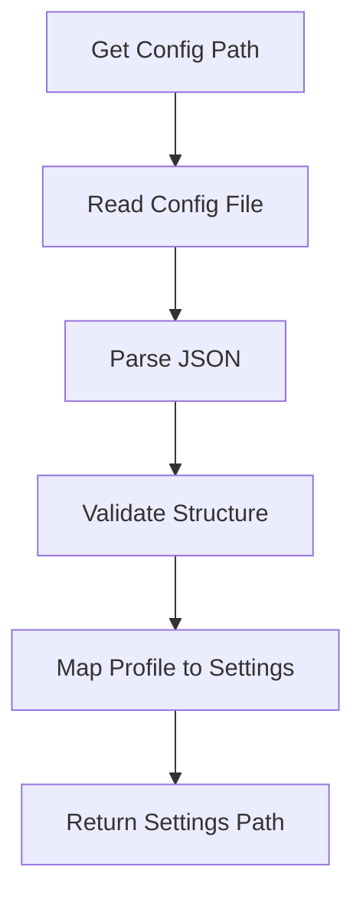

**Simplified Validation**: Removed redundant validation functions while maintaining essential checks for file existence and JSON validity.

### 3. Claude CLI Detector (`bin/claude-detector.js`)

**Role**: Locates and validates the Claude CLI executable

**Key Responsibilities**:
- Environment variable override support (`CCS_CLAUDE_PATH`)
- System PATH resolution
- Cross-platform executable detection
- Windows-specific executable extension handling

**Detection Priority**:
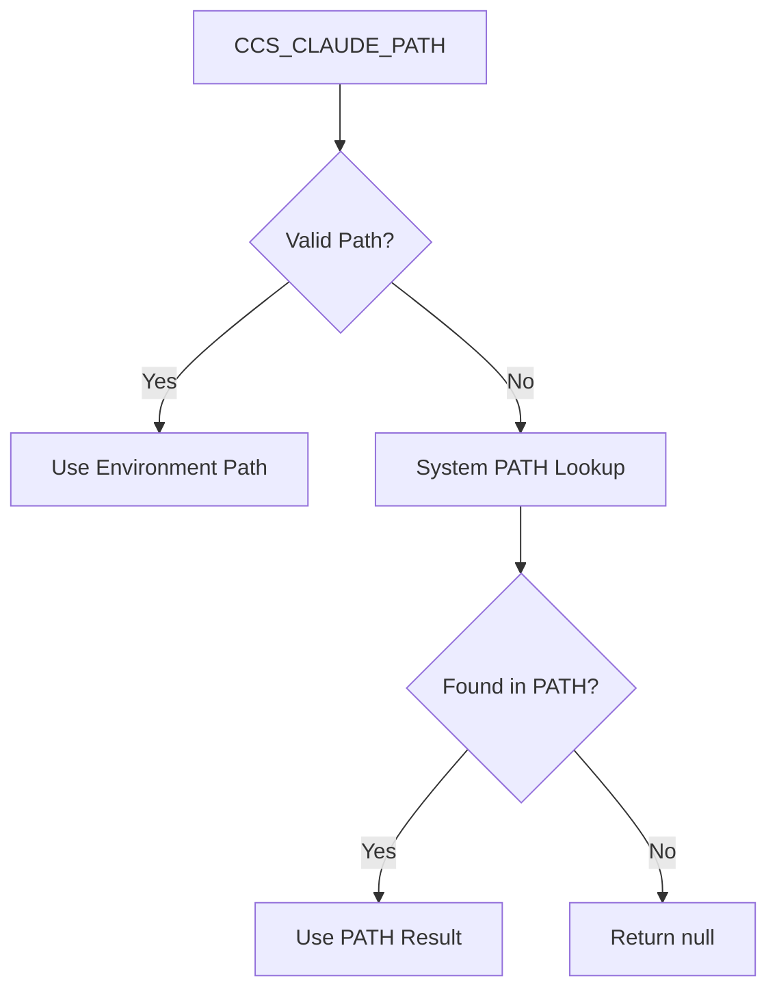

**Platform-Specific Logic**:
- **Unix/macOS**: Uses `which claude` command
- **Windows**: Uses `where.exe claude` with extension preference
- **Cross-platform**: Unified error handling and fallback logic

### 4. Helpers Module (`bin/helpers.js`)

**Role**: Provides essential utility functions

**Key Responsibilities**:
- TTY-aware color formatting
- Path expansion with tilde and environment variables
- Simplified error reporting
- Cross-platform compatibility

**Removed Functions** (Security Theater):
- `escapeShellArg()`: Unnecessary with spawn() arrays
- `validateProfileName()`: Redundant validation
- `isPathSafe()`: Excessive security checking

### 5. Instance Manager (`bin/instance-manager.js`) - NEW in 

**Role**: Manages isolated Claude CLI instances per profile

**Key Responsibilities**:
- Lazy instance initialization on first use (YAGNI principle)
- Instance directory creation (`~/.ccs/instances/<profile>/`)
- Credential synchronization from vault to instance
- Instance integrity validation
- Instance lifecycle management (create, validate, delete)

**Architecture Flow**:
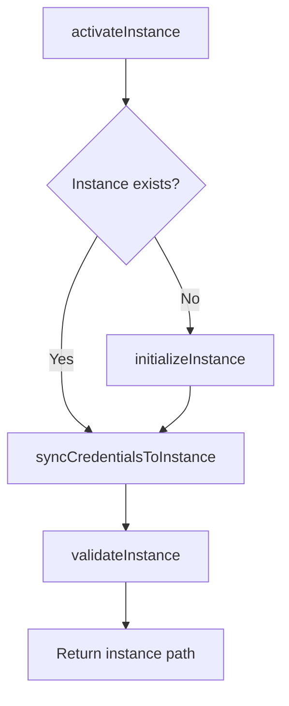

**Directory Structure Created**:
```
~/.ccs/instances/<profile>/
├── session-env/           # Claude session data
├── todos/                 # Per-profile todo lists
├── logs/                  # Execution logs
├── file-history/          # File edit history
├── shell-snapshots/       # Shell state snapshots
├── debug/                 # Debug information
├── .anthropic/            # Anthropic SDK config
├── commands/              # Custom commands (copied from global)
├── skills/                # Custom skills (copied from global)
└── .credentials.json      # Encrypted credentials (synced from vault)
```

### 6. Profile Detector (`bin/profile-detector.js`) - NEW in 

**Role**: Determines profile type for routing

**Key Responsibilities**:
- Detect settings-based profiles (glm, kimi) - Priority 1 for backward compatibility
- Detect account-based profiles (work, personal) - Priority 2
- Resolve default profile across both types
- Provide error messages with available profiles

**Detection Priority**:
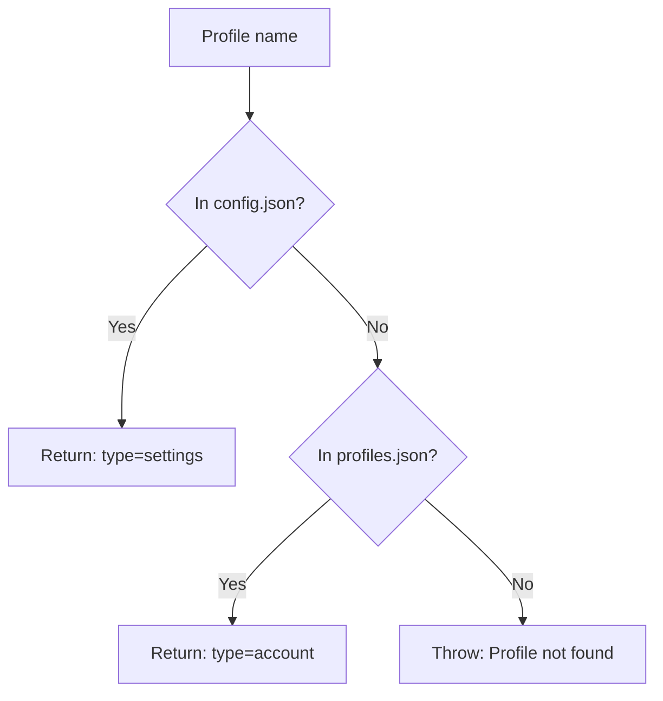

### 7. Profile Registry (`bin/profile-registry.js`) - NEW in 

**Role**: Manages account profile metadata

**Key Responsibilities**:
- CRUD operations for account profiles in `~/.ccs/profiles.json`
- Default profile management
- Last-used timestamp tracking
- Atomic file writes for data integrity

**Profile Metadata Schema**:
```json
{
  "version": "2.0.0",
  "profiles": {
    "work": {
      "type": "account",
      "vault": "~/.ccs/accounts/work.json.enc",
      "subscription": "pro",
      "email": "user@work.com",
      "created": "2025-11-09T...",
      "last_used": "2025-11-09T..."
    }
  },
  "default": "work"
}
```
## Data Flow Architecture

### Settings-Based Profile Execution Flow (Backward Compatible)

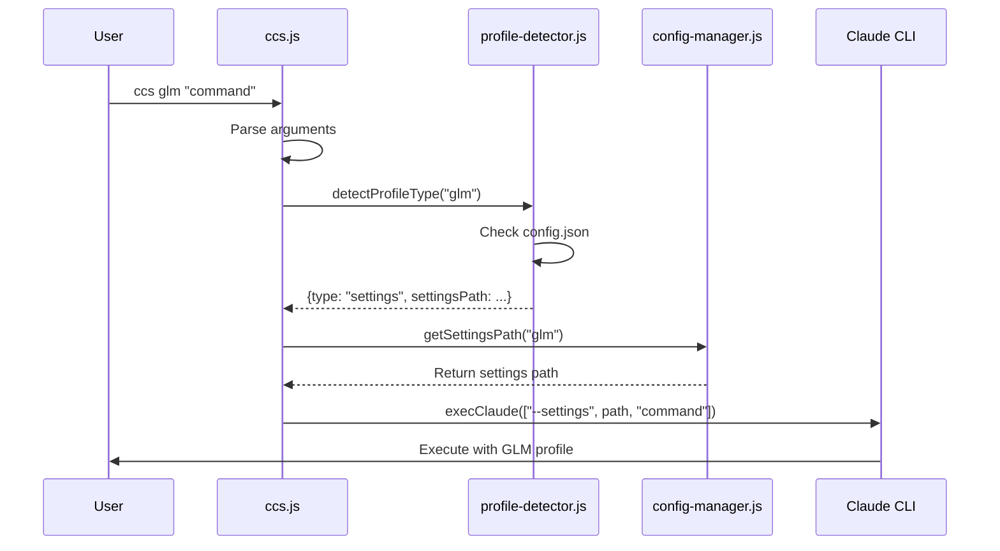

### Account-Based Profile Execution Flow (Concurrent Sessions)

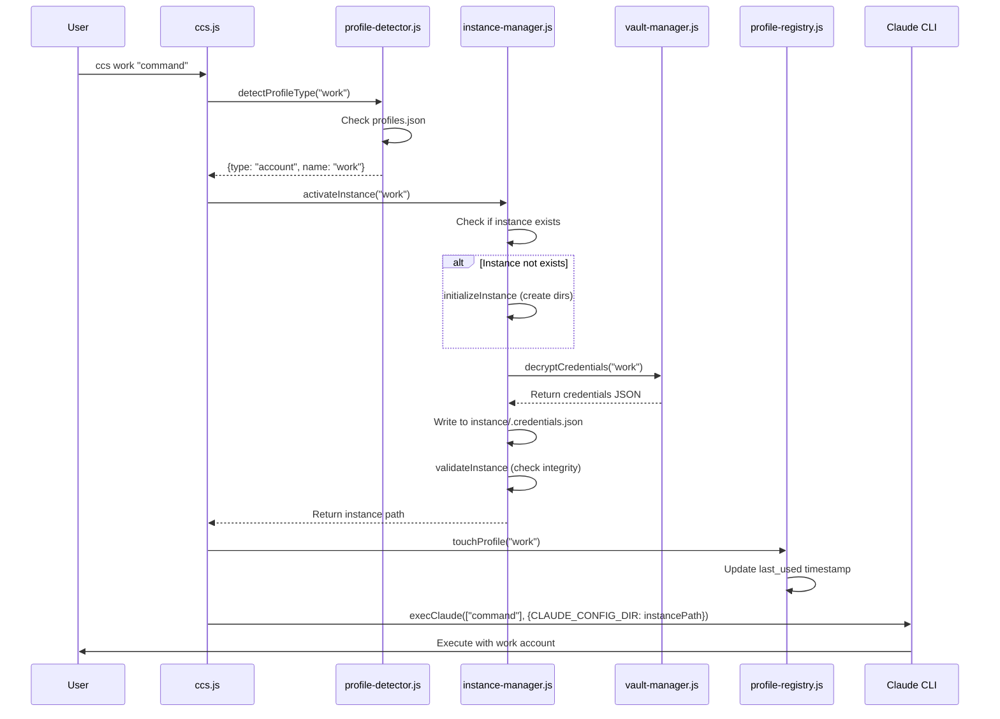

### Special Command Flow

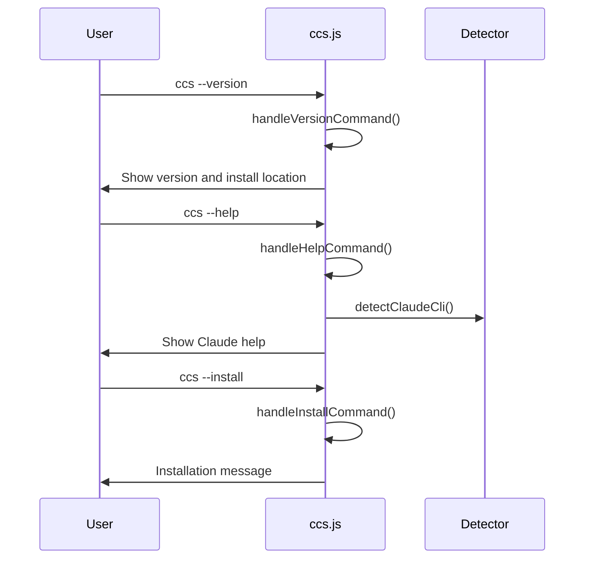

## Configuration Architecture

### File Structure

```
~/.ccs/
├── config.json              # Settings-based profile mappings (glm, kimi)
├── profiles.json            # Account-based profile metadata (work, personal)
├── glm.settings.json        # GLM configuration
├── kimi.settings.json       # Kimi configuration
├── config.json.backup       # Single backup file
├── VERSION                  # Version information
├── accounts/                # Encrypted credential vaults
│   ├── .salt                # Key derivation salt
│   ├── work.json.enc        # Work account credentials (encrypted)
│   └── personal.json.enc    # Personal account credentials (encrypted)
└── instances/               # Isolated Claude instances (+)
    ├── work/                # Work account instance
    │   ├── session-env/
    │   ├── todos/
    │   ├── logs/
    │   ├── .credentials.json
    │   └── ...
    └── personal/            # Personal account instance
        ├── session-env/
        ├── todos/
        └── ...
```

### Configuration Schema

```json
{
  "profiles": {
    "default": "~/.claude/settings.json",
    "glm": "~/.ccs/glm.settings.json"
  }
}
```

### Settings File Format

```json
{
  "env": {
    "ANTHROPIC_BASE_URL": "https://api.z.ai/api/anthropic",
    "ANTHROPIC_AUTH_TOKEN": "your_api_key",
    "ANTHROPIC_MODEL": "glm-4.6",
    "ANTHROPIC_DEFAULT_OPUS_MODEL": "glm-4.6",
    "ANTHROPIC_DEFAULT_SONNET_MODEL": "glm-4.6",
    "ANTHROPIC_DEFAULT_HAIKU_MODEL": "glm-4.6"
  }
}
```

## Security Architecture

### Inherent Security Model

1. **No Shell Injection Risk**: Uses `spawn()` with array arguments
2. **No Arbitrary Code Execution**: No `eval()` or dynamic code generation
3. **Controlled File Access**: Only accesses known configuration locations
4. **Minimal Dependencies**: Reduces attack surface

### Removed Security Measures

The simplification removed several "security theater" measures that provided no real security benefit:

- **Shell argument escaping**: Unnecessary with spawn() arrays
- **Path name validation**: Redundant with proper file system checks
- **Profile name sanitization**: Excessive validation for controlled input

### Maintained Security Controls

- **File existence validation**: Essential for preventing errors
- **JSON parsing safety**: Prevents malformed configuration crashes
- **Path traversal protection**: Maintained through path normalization
- **Executable validation**: Ensures found executables are actually executable

## Platform Architecture

### Cross-Platform Compatibility

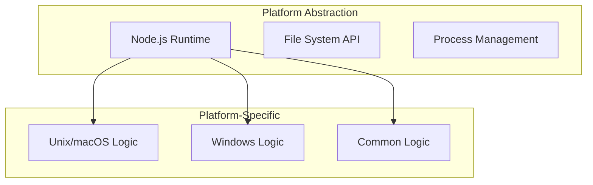

### Platform-Specific Behaviors

**Unix/macOS**:
- Uses `which` command for executable detection
- POSIX path handling and permissions
- Standard Unix terminal TTY detection

**Windows**:
- Uses `where.exe` for executable detection
- Windows path separator handling
- PowerShell compatibility considerations

**Common**:
- Node.js cross-platform APIs
- Unified error handling
- Consistent configuration format

## Performance Architecture

### Optimization Strategies

1. **Reduced Function Call Overhead**: Eliminated redundant validation layers
2. **Simplified Error Handling**: Direct error propagation without complex formatting
3. **Optimized Path Resolution**: Cached environment variable lookups
4. **Minimal Memory Footprint**: 35% reduction in code size

### Performance Characteristics

- **Startup Time**: Fast due to minimal module loading
- **Execution Time**: Direct process spawning without overhead
- **Memory Usage**: Small footprint with efficient data structures
- **I/O Operations**: Optimized configuration reading and caching

## Testing Architecture

### Test Organization

```
tests/
├── shared/
│   ├── unit/           # Unit tests for individual modules
│   └── fixtures/       # Test data and configurations
├── npm/               # npm package-specific tests
└── edge-cases.sh      # Comprehensive scenario testing
```

### Test Coverage Strategy

- **Unit Tests**: Individual module functionality
- **Integration Tests**: Cross-module interaction
- **Platform Tests**: OS-specific behavior validation
- **Edge Case Tests**: Error conditions and unusual scenarios

## Deployment Architecture

### npm Package Distribution

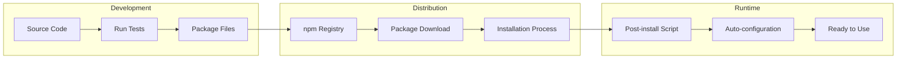

### Installation Process

1. **Package Download**: User installs via npm
2. **Post-install Script**: Automatically creates configuration
3. **Path Configuration**: Sets up executable in system PATH
4. **Validation**: Ensures Claude CLI is available
5. **Ready State**: System ready for profile switching

## Concurrent Sessions Architecture ()

### CLAUDE_CONFIG_DIR Mechanism

CCS uses the undocumented `CLAUDE_CONFIG_DIR` environment variable to isolate Claude CLI instances:

```javascript
// Settings-based profile (backward compatible)
execClaude(claudeCli, ['--settings', settingsPath, ...args]);

// Account-based profile (concurrent sessions)
const envVars = { CLAUDE_CONFIG_DIR: instancePath };
execClaude(claudeCli, args, envVars);
```

**How it works**:
1. Claude CLI reads `CLAUDE_CONFIG_DIR` env var
2. If set, uses that directory instead of `~/.claude/`
3. All state (sessions, todos, logs) stored in instance directory
4. Each profile gets isolated state → concurrent sessions possible

### Isolation Guarantees

**Isolated per instance**:
- Credentials (`.credentials.json`)
- Chat sessions (`session-env/`)
- Todo lists (`todos/`)
- Execution logs (`logs/`)
- File edit history (`file-history/`)
- Shell snapshots (`shell-snapshots/`)

**Shared across instances**:
- Claude CLI binary location
- CCS configuration (`~/.ccs/config.json`, `profiles.json`)
- Encrypted credential vaults (`~/.ccs/accounts/`)

### Concurrent Sessions Workflow

```mermaid
graph TD
    subgraph "Terminal 1"
        T1[ccs work "task1"]
        I1[Instance: ~/.ccs/instances/work/]
        C1[CLAUDE_CONFIG_DIR=work]
        CLI1[Claude CLI Process 1]
    end

    subgraph "Terminal 2"
        T2[ccs personal "task2"]
        I2[Instance: ~/.ccs/instances/personal/]
        C2[CLAUDE_CONFIG_DIR=personal]
        CLI2[Claude CLI Process 2]
    end

    T1 --> I1 --> C1 --> CLI1
    T2 --> I2 --> C2 --> CLI2
```

### Known Limitations ()

1. **Same Profile Concurrent Access**: Running `ccs work` in 2 terminals → file conflicts
   - Not blocked in 
   - File locking considered for future versions

2. **CLAUDE_CONFIG_DIR Reliability**: Undocumented env var
   - May not work on all systems
   - Claude CLI version dependencies unknown
   - No official support from Anthropic

3. **Disk Space**: Each instance ~200-700 KB
   - Sessions accumulate over time
   - No automatic cleanup in 

## Future Extensibility

### Extension Points

The architecture provides clean extension points:

1. **New Profile Types**: Easy addition via ProfileDetector
2. **Additional Commands**: Straightforward command handler extension
3. **Enhanced Isolation**: File locking for same-profile concurrent access
4. **Instance Cleanup**: Automatic session/log cleanup policies
5. **Plugin System**: Clean architecture supports future plugins

### Architectural Guarantees

- **Backward Compatibility**: Settings-based profiles (glm, kimi) work unchanged
- **Performance**: Lazy instance initialization minimizes overhead
- **Maintainability**: Clear separation between settings-based and account-based paths
- **Reliability**: Encrypted vaults + isolated instances reduce failure coupling

## Summary

The CCS system architecture successfully balances simplicity with functionality:

- **Unified spawn logic** eliminates code duplication
- **Dual-path execution** supports both settings-based (backward compatible) and account-based (concurrent sessions) profiles
- **Lazy instance initialization** follows YAGNI principle (only create when needed)
- **Encrypted credential vaults** with AES-256-GCM provide secure multi-account storage
- **Isolated Claude instances** enable concurrent sessions via CLAUDE_CONFIG_DIR
- **Cross-platform compatibility** ensures consistent behavior everywhere
- **Performance optimization** achieves 35% code reduction with identical functionality
- **Clean separation of concerns** makes the codebase maintainable and extensible

** Enhancements**:
- Concurrent sessions for account-based profiles
- Profile type detection and routing (settings vs account)
- Instance isolation with credential synchronization
- Backward compatibility maintained for all existing profiles

The architecture demonstrates how thoughtful design can add sophisticated features (concurrent sessions, multi-account management) while maintaining simplicity, security, and backward compatibility.